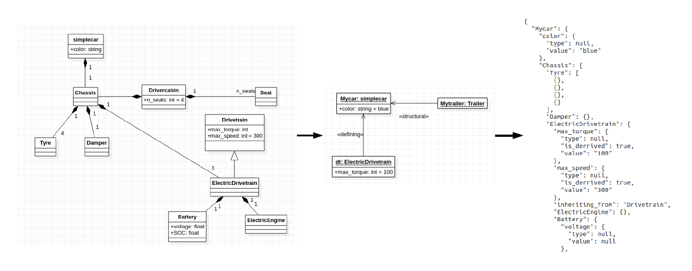

# Staruml .mdj to json Converter
## Abstract
Convert UML-Models created by Staruml into JSON-description of the model. This is useful if the UML model represents an information structure for a noSQL database. 

## Usecases for this software
UML seems to be a reasonable tool to model the information structure of arbitrary systems. Using modern noSQL-databases like DynamoDB or MongoDB, they are holding data in JSON-files and by that work on this file-basis. Using UML to model these files gives the possibility to model and manage complex systems graphically. 
Using this tool, the .mdj files generated by Staruml can be parsed into a JSON-file to load into a noSQL-database to form the database structure there.

## Usage
`$ python main.py -m /path/to/Model.mdj -s OBJECTNAME_TO_BEGINN_CONVERT -o output_file_name.txt`

main.py - entry point to start the converter
-m path to the .mdj model file, created by Staruml
-s top-object/subsystem of the hierarchy which should be transformed. Serves as the starting point. The tool then recursively iterates down the class-object-tree
-o output file ti save JSON content
-file_mode - can be either .xmi or .mdj (default). xmi-support still experimental
-classesOnly - flag to only convert class-hierarchy structures and ignore objects

## Simple Example
[>> Detailed Tutorial Here <<](doc/tutorial.md)

1. Starting point: simplecar.mdj. This models a simple car using the concepts of inheritance, aggregations, attributes, multiplicity, objects/instances, and links between them.
The model consists of the class-structures "simplecar" and "trailer". Both modeled using classes, inheritance, and aggregations. In an object diagram, they are put together to an actual vehicle "Mycar" using an actual trailer "Mytrailer". 

2. Convert Object to json-structure.
	* Create new virtualenvironment in model2json folder 
	`$ virtualenv env -p python3`
	* Install requirements using pip and the requirements.txt 
	`$ pip install -r requirements.txt`
	* Start the conversion 
	`$ python main.py -m simplecat.mdj -s Mycar -o simplecar.txt`
	* The result is saved in simpecar.txt

## Python Version & Requirements
Code is developed and tested using python3.7 on ubuntu 19.04

## Staruml Version
This tool is developed and tested for Staruml 3.1.0

### Reqirements
decorator==4.3.0  
dpath==1.4.2  
networkx==2.2  
xmltodict==0.11.0  

Best practice: Create a new virtual environment (e.g. python virtualenv) and install the given packages in that.

## WIP: .xmi Interface
To be more independent on the uml-modeling software, it is perfectly thinkable to integrate .xmi-file support into the tool. This process has already been started, but not yet cover all features. 

## Contact
Lukas Merkle  
lukas.merkle@tum.de
